# Архитектура

```mermaid
flowchart LR
  UI[React workspace] --> API[FastAPI]
  API --> Q[(SQLite jobs)]
  Q --> W[Single worker]
  CLI[CLI] --> P[Shared pipeline]
  W --> P
  P --> Import[Bounded OOXML importer]
  Import --> Profile[Effective tokens and pattern geometry]
  Profile --> Vision[Rendered thumbnail clustering]
  Vision --> Plan[Source-ID planner / optional LLM]
  Plan --> Layout[Layout constraints and text fit]
  Layout --> PPTX[Native PPTX exporter]
  PPTX --> Render[LibreOffice + Poppler]
  Render --> Audit[Deterministic + heuristic + optional VLM audit]
  Audit --> Files[PPTX / PDF / HTML / manifests]
  Files --> UI
```

Импортер разрешает темы/мастера/макеты и координаты групп. Профиль сохраняет связь
правила с исходным слайдом/master scope. Подбор использует геометрию, сложность и
содержание; имена брендов и файлов не участвуют. Визуальный кластеризатор — небольшие
RGB-признаки рендера + структурные признаки; это не обученная модель понимания слайдов.

Планировщик сохраняет факты и стабильные ID. AI отвечает за группировку/порядок и выбор исходных pattern IDs/слотов для всех вариантов;
фактические числа и исходные формулировки переносятся программно. Layout не доверяет
координаты модели: валидирует выбранные области шаблона, оценивает переносы, отмечает переполнение.
До отсчёта VLM может описать композиции и сохранить кэш. После рендера выполняется
один пакетный VLM-аудит и максимум один запрос ремонта; общий deadline — 300 с.
Охват и статус изменённых после аудита слайдов учитываются явно; см. MODELS.md.
Экспорт клонирует native OOXML, сохраняет фирменные ресурсы и очищает sample content.
Результат проходит независимый renderer и проверки извлечённого текста.

Поддержка импорта неполная: повороты/сложные group transforms, декоративный текст в
мастерах, фирменные шрифты и нестандартные объекты могут потребовать ручной проверки.
OOXML-метрики не равны доказанной визуальной идентичности. Bitmap clustering не заменяет
VLM. Пропущенные проверки показываются отдельно.

Один worker на каталог данных. Задачи сериализованы, SQLite WAL. Перезапущенная задача
получает interrupted; повторный запуск создаётся отдельно. Отмена проверяется между
стадиями; текущий render/inference ограничен timeout и может завершиться до отмены.
Исправление — новая версия с сохранённым планом, ссылкой на родителя и выбранными findings.

Host renderer: одноразовый Docker с сетью none, read-only root, tmpfs, CPU/RAM/PID limits,
drop capabilities, только каталог текущего вывода mounted. Контейнер удаляется и при timeout.
Compose: LibreOffice работает в том же non-root контейнере; это удобный локальный режим,
не отдельная граница безопасности между renderer и API. Публичная конфигурация
использует HTTPS-прокси и обязательный HTTP Basic пароль для общей команды;
загрузка файлов доступна только участникам с паролем. Это не изоляция недоверенных
арендаторов. Настройки провайдера хранятся отдельно, ключи не возвращаются API.
CI/CD и собственный домен описаны в QUICKSTART.md.

ZIP/XML: лимиты файла, числа частей, expanded bytes; traversal, DTD/entities, активные
части и внешние отношения запрещены/удалены. Артефакты доступны только по allowlist.
Оригинал шаблона сохраняется отдельно; парсер и renderer получают очищенную копию
при экспорте. Учесть исходный шаблон при визуальном анализе — тоже недоверенный файл.
